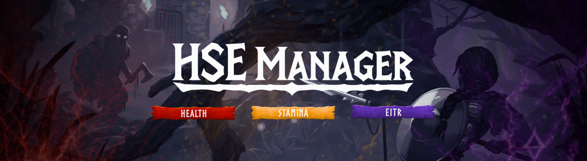

# Health, Stamina & Eitr - Manager

  

  
  
  
  
  <!-- Once published, replace the namespace/package below with your real Thunderstore listing -->
  

Tired of choosing between a modded save and Valheim actually feeling like Valheim? HSE Manager lets you set your own Health, Stamina, and Eitr, without touching anything else the game already does well.

Your food still matters. Your Comfort still matters. Your skills still level up the same way. HSE Manager sits quietly on top of the systems you already know, and only changes the numbers you tell it to change.

## What you get

- Set your own base Health, Stamina, and Eitr, then let food bonuses stack on top exactly like vanilla.
- Turn on extra regeneration for any of the three, independent of food and Comfort, if you want it.
- Go infinite on Stamina or Eitr without losing a single vanilla action, skill gain, or animation.
- Keep your HUD bars compact, even at high values, with the fixed-width option.
- Ask the Stamina or Eitr bar to just stay on screen, instead of fading in and out.
- On a server, the server decides. HSE Manager keeps everyone on the same rules for as long as they are connected, and gives your own settings back the moment you disconnect.

## See it in action

<table>
  <tr>
    <td align="center">
       
    </td>
    <td align="center">
       
    </td>
    <td align="center">
       
    </td>
  </tr>
</table>

## Requirements

- Valheim 0.221.12 (network version 36)
- [BepInExPack Valheim](https://thunderstore.io/c/valheim/p/denikson/BepInExPack_Valheim/)
- [Jötunn, the Valheim Library](https://thunderstore.io/c/valheim/p/ValheimModding/Jotunn/)

## Installation

### With a mod manager (recommended)

Install through [r2modman](https://thunderstore.io/c/valheim/p/ebkr/r2modman/) or the Thunderstore Mod Manager. Both dependencies come along automatically.

### By hand

1. Install BepInExPack Valheim and Jötunn.
2. Download the latest release of HSE Manager.
3. Drop `HSEManager.dll` into `BepInEx/plugins/`.
4. Start the game once so the configuration file gets created.

## Making it yours

Everything lives in five sections, whether you are editing the `.cfg` file directly or using the in-game Configuration Manager:

| Section | What it controls |
|---|---|
| `01. Health` | Your base health |
| `02. Stamina` | Base stamina, infinite stamina |
| `03. Eitr` | Base Eitr, infinite Eitr |
| `04. Regeneration` | Extra Health, Stamina, and Eitr regeneration per second |
| `05. HUD` | Fixed-width bars and always-show options for Stamina and Eitr |

Sections 01 through 04 are gameplay: on a server, they follow the server's rules for as long as you are connected. Section 05 is yours alone, on every server, every time.

## Playing with others

HSE Manager checks, through Jötunn, that everyone joining has the mod installed before letting them in, and keeps every connected client on the same gameplay settings as the server. If you run the server, your configuration file is the one that counts. Regular players connecting to it cannot override your rules while they are on your world.

## Keep it going

HSE Manager stays free, but staying maintained and up to date with every Valheim update takes real time. If it earns a place in your modlist, a small donation goes a long way toward keeping it there.

  

<!-- Swap the href above and the badge below once you have picked a donation platform -->

## Found a bug?

If something is not working as expected, whether it looks like a bug, a conflict with another mod, or an incompatibility with a Valheim update, please [open an issue on GitHub](https://github.com/Valesthor/HSE-Manager/issues). Include what happened, what you expected instead, and your `LogOutput.log` if possible.

Every report is investigated and tested. Confirmed bugs, regressions, or incompatibilities are fixed and released as soon as they are verified.

## Changelog

Every change, big or small, is tracked in [CHANGELOG.md](CHANGELOG.md).

## License

Released under the [MIT License](LICENSE).

## Author

Developed and maintained by Valesthor.

---

Copyright (c) 2026 Valesthor. HSE Manager is an independent, fan-made modification and is not affiliated with, endorsed by, or sponsored by Iron Gate AB or Coffee Stain Publishing. Valheim is a trademark of Iron Gate AB.